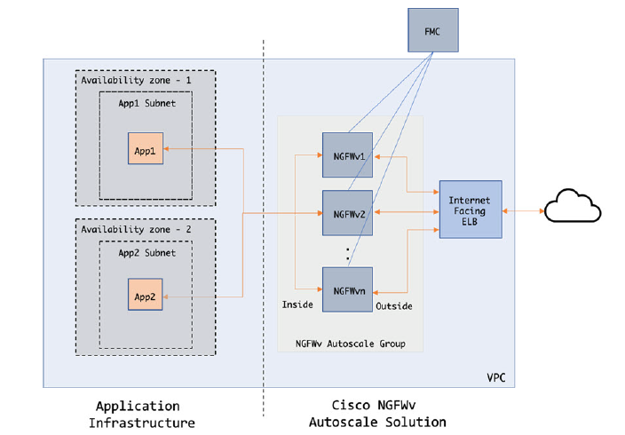

# Auto Scale Solution for FTDv on AWS

Cisco provides CloudFormation Templates and scripts for deploying an auto-scaling group of FTDv firewalls
using several AWS services, including Lambda, auto scaling groups, Elastic Load Balancing (ELB), Amazon
S3 Buckets, SNS, and CloudWatch.
FTDv Auto Scale in AWS is a complete serverless implementation (i.e. no helper VMs involved in the
automation of this feature) that adds horizontal auto scaling capability to FTDv instances in the AWS
environment.

The FTDv Auto Scale solution is a CloudFormation template-based deployment that provides: 
* Completely automated FTDv instance registration and de-registration with the FMC
* NAT policy, Access Policy, and Routes automatically applied to scaled-out FTDv instances
* Support for Load Balancers and multi-availability zones.

## Auto Scale Use Case

The Use Case for this FTDv AWS Auto Scale Solution is shown in Figure,  Because the AWS Load Balancer allows only Inbound-initiated connections, only
externally generated traffic is allowed to pass inside via the Cisco FTDv firewall. 

The Internet-facing Load Balancer will have a DNS name, and 0 to 4 ports can be kept open. Of those ports, 0 to 2 can be unsecured ports such as HTTP/80, and 0 to 2 can be secured ports such as HTTPS/443.

*Note:* Secured ports need an SSL/TLS certificate, as described SSL Server Certificate, on page 7 in the Prerequisites.

The Internet-facing load balancer can be a Network Load Balancer or an Application Load Balancer. All of
the AWS requirements and conditions hold true for either case. As indicated in the Use Case diagram, the right side of the dotted line is deployed via the FTDv templates. The left side is completely user-defined.

*Note:* Application-initiated outbound traffic will not go through the FTDv.

**FTDv Auto Scaling for AWS**
* NGFWv6.6.0 : [Code](autoscale/aws/NGFWv6.6.0/)     |     [README](autoscale/aws/NGFWv6.6.0/README.md)     |     [Deployment/Configuration Guide](autoscale/aws/NGFWv6.6.0/deploy-ftdv-auto-scale-for-aws.pdf)
* NGFWv6.7.0 : [Code](autoscale/aws/NGFWv6.7.0/)     |     [README](autoscale/aws/NGFWv6.7.0/README.md)     |     [Deployment/Configuration Guide](autoscale/aws/NGFWv6.7.0/deploy-ftdv-auto-scale-for-aws.pdf)
