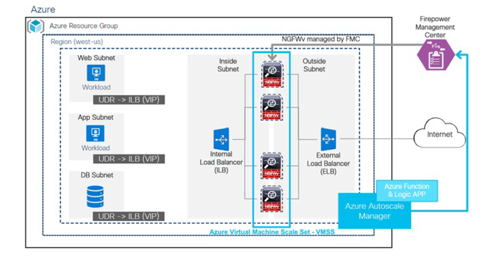

# Auto Scale Solution for FTDv on Azure

FTDv Auto Scale for Azure is a complete serverless implementation which makes use of serverless
infrastructure provided by Azure (Logic App, Azure Functions, Load Balancers, Security Groups, Virtual
Machine Scale Set, etc.).

Some of the key features of the FTDv Auto Scale for Azure implementation include:  
* Completely automated FTDv instance registration and deregistration with the FMC.
* NAT policy, Access policy, and Routes automatically applied to scaled-out FTDv instances.
* Support for standard Load Balancers.
* Supports FTDv deployment om multi-availability zones.
* Support for enabling and disabling the Auto Scale feature.
* Azure Resource Manager (ARM) template-based deployment.
* Works only with FMC; the Firepower Device Manager is not supported
* Support to deploy the FTDv with PAYG or BYOL licensing mode. PAYG is applicable only for FTDv
software version 6.5 and onwards

* Cisco provides an Auto Scale for Azure deployment package to facilitate the deployment.

## Auto Scale Use Case (Azure)
The FTDv Auto Scale for Azure is an automated horizontal scaling solution that positions an FTDv scale set

sandwiched between an Azure Internal load balancer (ILB) and an Azure External load balancer (ELB).  
* The ELB distributes traffic from the Internet to FTDv instances in the scale set; the firewall then forwards
traffic to application.
* The ILB distributes outbound Internet traffic from an application to FTDv instances in the scale set; the
firewall then forwards traffic to Internet.
* A network packet will never pass through both (internal & external) load balancers in a single connection.
 * The number of FTDv instances in the scale set will be scaled and configured automatically based on load conditions.
 
 ### FTDv Auto Scaling for Azure
* NGFWv6.6.0 : [Code](autoscale/azure/NGFWv6.6.0/)     |     [README](autoscale/azure/NGFWv6.6.0/README.md)     |     [Deployment/Configuration Guide](autoscale/azure/NGFWv6.6.0/deploy-ftdv-auto-scale-for-azure.pdf)
* NGFWv6.7.0 : [Code](autoscale/azure/NGFWv6.7.0/)     |     [README](autoscale/azure/NGFWv6.7.0/README.md)     |     [Deployment/Configuration Guide](autoscale/azure/NGFWv6.6.0/ftdv-azure-autoscale-v67.pdf)

### Deployment Templates
* Azure NGFWv Deployment Template for NGFWv6.6.0: [README](deployment-templates/azure/README.md) | [NFWv/FTDv](deployment-templates/azure/NGFWv6.6.0/ftdv/README.md)  |   [FMCv](deployment-templates/azure/NGFWv6.6.0/fmcv/README.md)
* Azure NGFWv Deployment Template for NGFWv6.7.0: [README](deployment-templates/azure/README.md) | [NFWv/FTDv](deployment-templates/azure/NGFWv6.7.0/ftdv/README.md)  |   [FMCv](deployment-templates/azure/NGFWv6.7.0/fmcv/README.md)
