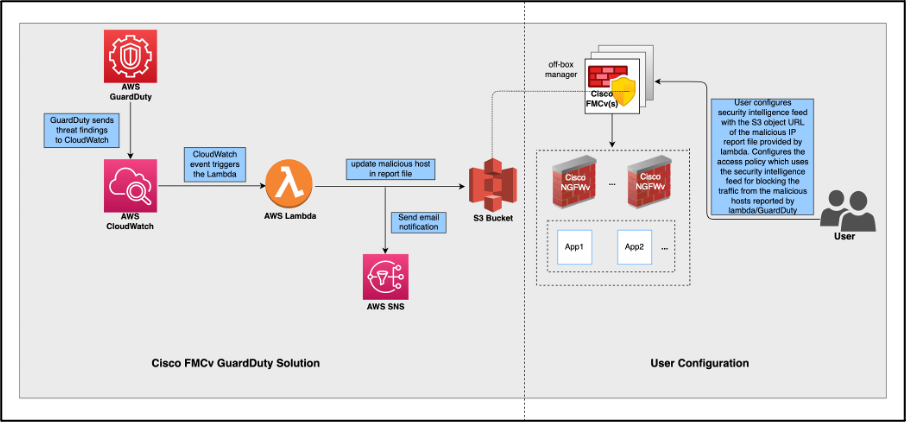
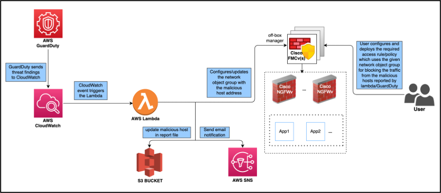
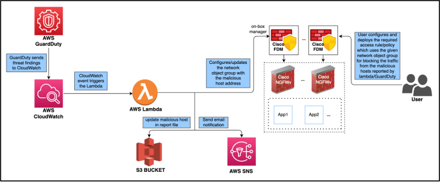

# **Cisco NGFWv - AWS GuardDuty Integration**
  Cisco provides set of Scripts(lambda function) and CloudFormation template to allow the integration of the AWS GuardDuty Service with Cisco Firepower Next-Generation Firewall Virtual(NGFWv).

  Amazon GuardDuty is a monitoring service which processes data from various sources in AWS environment (VPC Logs, CloudTrail management event logs, CloudTrail S3 data event logs, DNS logs etc.) and identifies potentially unauthorized and malicious activity in the AWS environment. <br><br>
  This solution make use of the threat analysis data/results from Amazon GuardDuty (malicious IPs generating threats, attacks etc.) and feeds that information(malicious IP) to the Cisco Firepower Next-Generation Firewall Virtual(**NGFWv**) via the managers: *Cisco Firepower Management Center Virtual* (**FMCv**), *Cisco Firepower Device Manager* (**FDM**) to protect the underlying network and applications against future threats originating from these sources(malicious IP).

  This solution makes use of several AWS services, including GuardDuty, CloudWatch, Lambda, S3 Bucket, SNS, etc.

  All this is achieved using a lambda function which is triggered by a CloudWatch event when the finding is raised by AWS GuardDuty.
  * The findings detected by GuardDuty will be processed (analysed and filtered) based on pre-defined criteria like severity, direction attribute(INBOUND only), availability of malicious IP, etc. in the GuardDuty finding.
  * Once the finding is processed, we will get the remote IP which caused the GuardDuty alert, this IP will be considered malicious IP.
  * In next step, the network object group is created/updated with the malicious IP found after processing on the NGFWv manager:[ **FMCv**, **FDM** ]<br>
  Note that the scope of lambda function is limited only to updating the network object group with the malicious host IP and it will be the user’s responsibility:
    * to deploy these changes/updates (to the network object group(s) on FMCv, FDM) on the device(s)
    * to make use of the network object group in AC policy/rule for blocking the traffic and deploy it on the device(s)

  Apart from updating the network object group on NGFWv managers the lambda function also:
  * Creates a report file in the S3 bucket containing all the IPs processed by it
  * Sends a mail notification to the administrator regarding the various updates carried out by the lambda function

  Along with the network object group update approach, on FMCv, users can alternatively use the S3 bucket report file’s URL as security intelligence feed URL. This can be further used in the AC Policy to block the traffic from any host listed in the feed.(S3 bucket file)

  *Disclaimer: It is required to have prior understanding of Cisco NGFWv, AWS resources & deployments.*
  <br><br>

## **How the Cisco NGFWv – AWS GuardDuty Integration Solution Works**
  This integration solution covers both off-box(FMCv) and on-box(FDM) management of the NGFWv.
  1. **Off-box management (FMCv)**

      In this case there are two options:
      1. **Security Intelligence Feed URL**

          Users may use the S3 bucket report file’s(with malicious IP list) URL in the Security Intelligence Feed configuration on the FMCv and associate it with a AC policy.<br><br>
          In this case, lambda will not perform any updates on the device – FMCv and it will be user’s responsibility to manually create the Security Intelligence Feed using S3 bucket file and then create/update/deploy any Access policy to use the feed for blocking traffic.<br><br>
          This configuration will be required only once per device and the subsequent updates to the S3 bucket report file(by lambda function) will be automatically fetched by FMCv based on the Security Intelligence Feed configuration.
          <br><br>
          
          <br>*Figure 1: Cisco NGFWv – AWS GuardDuty Integration Solution with off-box manager(FMCv) using Security Intelligence Feed URL*
          <br><br>

      2. **Network Object Group(s) Update**

           In this case, the lambda function will update network object group(s) with malicious host IP on the FMCv.<br>
           Note that, the lambda function will only update the network object group(s) on the NGFWv manager – FMCv and user will be responsible for:
           * deploying the network object group(s) changes/updates done on FMCv to the underlying device(s): NGFWv/FTDv
           * creating and deploying any AC policy/rule to use the updated network object group(s) and blocking the traffic

           <br>
           Note that, this deployment of changes will be needed after every update to the network object groups.

           <br><br>
           
           <br>*Figure 2: Cisco NGFWv – AWS GuardDuty Integration Solution with off-box manager(FMCv) using network object group*
           <br>
           <br>


  2. **On-box management (FDM)**

      In this case only one option is available: **Network Object Group(s) Update**<br>
      This is same as the **Network Object Group(s) Update** on the FMCv and the lambda function will update network object group(s) with malicious host IP on the FDM.<br>
      Note that, the lambda function will only update the network object group(s) on the FDM and user will be responsible for:
      *  deploying the network object group(s) changes/updates done on FDM
      *  creating and deploying any AC policy/rule to use the updated network object group(s) and blocking the traffic

      <br>
      Note that, this deployment of changes will be needed after every update to the network object groups.

      <br><br>
      
      <br>*Figure 3: Cisco NGFWv – AWS GuardDuty Integration Solution with on-box manager(FDM) using network object group*
      <br><br>
      <br>


## **Solution Deployment Steps**

   **Note**: <br>
    AWS Services used in this solution are region specific(GuardDuty, lambda, Dynamo DB, etc.), therefore ensure that all the  resources are in same region.<br><br>

1. Ensure that GuardDuty Service is enabled on the AWS.<br>
   To enable the service from AWS console:
   ```
   AWS Console --> Services --> GuardDuty --> Try GuardDuty for free / Get Started --> Enable GuardDuty
   ```

2. Download the scripts and template for the solution are from the GitHub repository.<br>
   Repo URL:\<Public REPO URL> <br>
   Clone the repository:<br>
   ```
   git clone <Public REPO URL>
   ```

   Repository contents:<br>
   ```
   /
   - README.MD
   - configuration/ => NGFWv Manager Configuration file template
   - images/
   - lambda/ => Lambda function python files
   - templates/ => CloudFormation template for deployment
   ```

3. NGFWv Manager configurations

    1. **Security Intelligence Feed** based solution (on FMCv)

       In this case:
        * User need not provide any NGFWv managers details in the device manager configuration file <br>
        (the input configuration file can be skipped altogether if only this solution is used on all NGFWv managers)
        * In order to use the Security Intelligence, user will need to enable the **Threat** license.
        * Create the Security Intelligence Feed using the S3 bucket file(report) URL on the FMCv and associate it with a AC policy/rule.<br>
          On FMCv UI:<br>
          ```
          Objects -> Object Management --> Security Intelligence --> URL Lists and Feeds --> Add URL Lists and Feeds --> Name (aws-guardduty-feed)--> Type (Feed) --> Feed URL (S3 bucket report file URL) --> Update frequency (desired value)--> Save
          ```
          Please refer the FMCv documentation for details on this configuration:
            [Creating Security Intelligence Network Feed](https://www.cisco.com/c/en/us/td/docs/security/firepower/70/configuration/guide/fpmc-config-guide-v70/reusable_objects.html#ID-2243-00000291)<br> <br>
          This configuration will be required only once per FMCv device and the subsequent updates to the S3 bucket report file(by lambda function) will be automatically fetched and applied to the devices based on the Security Intelligence Feed configuration on FMCv.<br><br>
          In this case you will need the URL of report file on S3 bucket. <br>
          For this you can use one of the below approaches:
          1. Wait for the first mail notification with any reported finding, this will ensure that the report file has been created by lambda function. <br>
          The mail will also contain the URL for the report file on S3 bucket.
          2. In 2nd option, you may pre-create the empty report file on the S3 bucket.<br>
          (same bucket and folder as for uploading the artifacts)<br>
          The name of the report file must be of the following format: `<deployment-name>-report.txt` <br>
          Where, <deployment-name> is the parameter to be used while deploying the CloudFormation template.


          <br>Then you can use the URL of this report file on the FMCv to update the `Security Intelligence Feed`  configuration.<br><br>

        **NOTE:** <br>
        1. For this solution to work, the URL of the report file must be accessible to the FMCv. <br>
        Therefore ensure that the report file has proper configuration(permissions) to allow this access. (recommended to configure the public access for the report file in S3 bucket)<br>
        Considering this, you may verify the public access to the file using the URL (wget or access the URL on a browser) before configuring it in the `Security Intelligence Feed`.
        2. It is recommended to have update intervals longer than or equal to 30 minutes for the `Security Intelligence Feed`, this is considering the fact that the GuardDuty findings are not generated very frequently.
        3. In case you want to configure the update intervals shorter than 30 minutes(5 or 15 minutes) for the `Security Intelligence Feed`, you will have to provide the MD5 URL corresponding to the feed URL. <br>
        For this purpose, lambda function will also create/update a file containing the MD5 checksum of the report file. <br>
        The file will be in same bucket(and folder) as the report file and its name will be: `<deployment-name>-report-md5.txt`<br>
        Therefore, if you are choosing the 2nd option above(to pre-create) the empty report file, then you will have to compute the md5sum of the empty report file and create the MD5 checksum file `<deployment-name>-report-md5.txt` as well. This file will contain only the md5sum of report file and nothing else(no comments or file name etc.)
        <br>e.g.
            ```
            $ cat ngfwv-gd-integ-report-md5.txt
            9a05aea0ee691ebe22762fbcd75eafba
            ```


    2. **Network Object Group(s) Update** based solution (on FMCv, FDM)

        1. Create the network object groups for the hosts to be reported by the GuardDuty/lambda.<br>
           You will have to create the object group with a dummy IP.<br> <br>
           This needs to be created on all the NGFWv Managers which will be configured to be updated by the solution.<br>
           Also, you can create multiple network object groups on single NGFWv manager to be updated.<br> <br>
           Please refer the respective configuration guide for details on how to create this:<br>
           * [FMCv Configuration Guide](https://www.cisco.com/c/en/us/td/docs/security/firepower/70/configuration/guide/fpmc-config-guide-v70.html)
           * [FDM Configuration Guide](https://www.cisco.com/c/en/us/td/docs/security/firepower/70/fdm/fptd-fdm-config-guide-700.html)

           As network object group cannot be empty, initially you may have to create it with a with a dummy IP.<br>
           In case you don’t create the network object group beforehand, the lambda function will create and update the malicious IPs in a network object group with the default name: **aws-gd-suspicious-hosts**


        2. Create appropriate AC policy/ rule to block the traffic using the network object group (above)<br>
           Please refer the respective configuration guide for details on how to create this:
           * [FMCv Configuration Guide](https://www.cisco.com/c/en/us/td/docs/security/firepower/70/configuration/guide/fpmc-config-guide-v70.html)
           * [FDM Configuration Guide](https://www.cisco.com/c/en/us/td/docs/security/firepower/70/fdm/fptd-fdm-config-guide-700.html)

           <br>Note that this is optional and AC policy/rule can be created/updated at later stages also. (ensure to use the network object being updated by the lambda function)

        3. Create a separate user(e.g. aws-gd) on FMCv to be used by lambda function for configuration updates. (optional) <br>
           On FMCv, the user should have the **Network-Admin** or higher privileges for the managing FMC.<br>

           Please refer the section about creating users and roles in the [Firepower Management Center Configuration Guide.](https://www.cisco.com/c/en/us/td/docs/security/firepower/70/configuration/guide/fpmc-config-guide-v70.html)<br>

           On FDM, REST APIs need the ‘admin’ user and hence you will need to configure the same.


        4. Encrypt the password(s) and enable password(s) (*optional*)<br>
           If you are providing encrypted password, then please note that:
            * Encryption using the Symmetric KMS keys is only supported.
            * All the passwords in the NGFWv manager configuration file must be encrypted using the same KMS key.
              You may use the below command to generate encrypted password:
              ```
              aws kms encrypt --key-id <KMS-ARN> --plaintext <password>
              ```
              Encrypted Password is value of **CiphertextBlob** in above command output.<br>

              You will need the AWS CLI installed and configured to run the above command.<br>
              Please refer the AWS CLI documentation for more details: [AWS Command Line Interface](https://docs.aws.amazon.com/cli/latest/userguide/cli-chap-welcome.html)
              <br>
            * The ARN of the KMS key should be provided as the parameter during deployment of CloudFormation template

        5. Create the NGFWv manager configuration input file.<br>
           Refer the template config file template available under **configuration** folder: ```configuration/ngfwv-manager-config-input.ini```<br>

           Below are the various manager details needed:
           ```
           [ngfwv-1]      ==> Section name: Unique NGFWv manager Identifier (within the file)
           public-ip=<Public IP of NGFWv manager>
           device-type=<FDM or FMC>
           username=<Username for login on NGFWv manager>
           password=<Password (plaintext/encrypted using KMS)>
           object-group-name=<Network Object Group Name(s) to be updated with malicious host IP (comma separated values)>
           ```

           Note:
            1. Before configuring the credentials(username, password) for various FDM, FMCv devices in the configuration file, please ensure that login works properly using these credentials.
            2. Ensure that the entry/section for a FDM, FMCv device is added only once in the configuration file, multiple entries for same device may cause race conditions and nondeterministic behavior as lambda will work on to update all the devices simultaneously.<br>
            In case multiple network object group updates are needed on single device, same can be configured as comma separated values for the ```object-group-name``` attribute.
<br><br>
4. Prepare the lambda function zip file.<br>
   Create the zip file: ```ngfwv-gd-lambda.zip``` using the python files in lambda folder: ```lambda/*.py```
   ```
   $ cd lambda
   $ zip ngfwv-gd-lambda.zip *.py
   adding: aws.py (deflated 71%)
   adding: fdm.py (deflated 79%)
   adding: fmcv.py (deflated 79%)
   adding: main.py (deflated 73%)
   adding: utils.py (deflated 65%)
   $
   ```

5. Prepare the lambda layer zip file.<br>
    The lambda layer file: ```ngfwv-gd-lambda-layer.zip``` can be created on a Linux environment, such as Ubuntu 22.04 with Python 3.9 installed.
    ```
    mkdir -p layer
    virtualenv -p /usr/bin/python3.9 ./layer/
    source ./layer/bin/activate
    pip3.9 install cffi==1.15.0
    pip3.9 install cryptography==37.0.2
    pip3.9 install paramiko==2.7.1
    pip3.9 install requests==2.23.0
    mkdir -p ./python/.libs_cffi_backend/
    cp -r ./layer/lib/python3.9/site-packages/* ./python/
    zip -r ngfwv-gd-lambda-layer.zip ./python
    ```
   _Note: Install python3.9 and its dependencies(as shown below) for creating the layer._
     ```
     $ sudo apt update
     $ sudo apt install software-properties-common
     $ sudo add-apt-repository ppa:deadsnakes/ppa
     $ sudo apt install python3.9
     $ sudo apt install python3-virtualenv
     $ sudo apt install zip
     $ sudo apt-get install python3.9-distutils
     $ sudo apt-get install python3.9-dev
     $ sudo apt-get install libffi-dev
     ```

6. Create a S3 bucket and upload all the artifacts.
   Upload the below artifacts created in previous steps.
   1.  NGFWv Manager Configuration file: ```ngfwv-config-input.ini```<br>
   (not required in case all the managers plan to use the **Security Intelligence Feed based** solution )
   2.  Lambda layer zip file: ```ngfwv-gd-lambda-layer.zip```
   3.  Lambda function zip file: ```ngfwv-gd-lambda.zip```
   <br><br>

7.  Deploy the CloudFormation template<br>
    * **Parameters for CloudFormation template**<br>
      The following input parameters should be collected prior to deployment.<br>

        | Sr. No. | Parameter                             | Description                                                                                                                                                                                                                                                                    |
        | ------- | ------------------------------------- | ------------------------------------------------------------------------------------------------------------------------------------------------------------------------------------------------------------------------------------------------------------------------------ |
        | 1.      | Deployment name*                      | This will be used as prefix for all the resources created by the cloud formation template. <br> e.g. ```cisco-ngfwv-gd```                                                                                                                                                          |
        | 2.      | Minimum severity level of GD finding* | Minimum GuardDuty findings severity level to be considered for processing[1.0 to 8.9]. <br> Any GuardDuty finding reported with lesser severity than this will be ignored.<br> Severity classification, Low: 1.0 to 3.9, Medium: 4.0 to 6.9, High: 7.0 to 8.9. <br> e.g. ```4.0``` |
        | 3.      | Administrator email ID*               | Administrator email address to receive notifications regarding NGFWv manager updates done by lambda function. <br>e.g. ```abc@xyz.com```                                                                                                                                           |
        | 4.      | S3 Bucket name*                       | S3 Bucket name containing the files (lambda function zip,  lambda layer zip and/or NGFWv managers details file). <br>e.g. ```ngfwv-gd-bucket```                                                                                                                                   |
        | 5.      | S3 Bucket folder/path prefix          | S3 Bucket path/folder containing the config files, leave empty if there is no folder. <br> e.g. ```"", "cisco/ngfwv-gd/"```                                                                                                                                                        |
        | 6.      | Lambda layer zip file name*           | Lambda layer zip file name. <br>e.g. ```ngfwv-gd-lambda-layer.zip```                                                                                                                                                                                                               |
        | 7.      | Lambda function zip file name*        | Lambda function zip file name. <br>e.g. ```ngfwv-gd-lambda.zip```                                                                                                                                                                                                                  |
        | 8.      | NGFWv manager configuration file name | `*.ini` file containing NGFWv configuration details. (Public IP, username, password, device-type, network object group names, etc.)<br> e.g. ```ngfwv-config-input.ini``` <br><br> **Note:** This file is required only in case of the Network Object Group updates based solution and therefore this file can be skipped in case all the managers plan to use the Security Intelligence Feed based solution.                                                                                                                                   |
        | 9.  | ARN of KMS key used for password encryption | ARN of an existing KMS (AWS KMS key used for password encryption).<br>Leave empty in case plain text passwords are provided in the NGFWv manager configuration input file.<br>If specified, all the passwords mentioned in the NGFWv manager configuration input file must be encrypted.<br>The Passwords must be encrypted only using the specified ARN.<br>Generating encrypted passwords: <br>```aws kms encrypt --key-id <KMS ARN> --plaintext <password>``` <br>e.g. *arn:aws:kms:\<region>:\<aws-account-id>:key/\<key-id>* |
        | 10. | Enable/Disable debug logs*                  | Enable/Disable lambda function debug logs in CloudWatch. <br>e.g. ```enable or disable```                                                                                                                                                                                                                                                                                                                                                                                                                                          |

        ```*```: denotes the mandatory parameters.
        <br>

    * **Deploy the stack**<br>

        After all of the pre-requisites are completed for deployment, you can create the AWS CloudFormation stack. <br>
        Use the CloudFormation yaml template file in the template directory: `templates/cisco-ngfwv-gd-integration.yaml` <br>
        Provide the parameters as collected in previous step. <br><br>
        **Deployment:**
        ```
        AWS Console --> Services --> CloudFormation --> Stacks --> Create stack (with new resources) --> Prepare template(Template is ready) --> Specify template --> Template source(Upload a template file) --> \<update parameters> --> Create Stack
        ```
        Please refer AWS Documentation for deployment of CloudFormation template.
        [AWS Documentation](https://docs.aws.amazon.com/AWSCloudFormation/latest/UserGuide/GettingStarted.html)
        <br>

    * Subscribe to the email notifications <br>
        Once the CloudFormation template is successfully deployed, you will receive a SNS notification mail(on configured email ID) requesting you to subscribe.<br>
        You should subscribe to the same using the link provided in the mail.

## **Resources Created**
   Following resources are created by the CloudFormation template:
   * **AWS::SNS::Topic** : SNS Topic for publishing the email notifications.
   * **AWS::Lambda::Function, AWS::Lambda::LayerVersion** : Lambda function and lambda layer resources using the corresponding the zip file provided.
   * **AWS::Events::Rule** : CloudWatch event rule to trigger the lambda function based on the GuardDuty findings event.
   * **AWS::Lambda::Permission** : Permission for CloudWatch event rule to trigger the lambda function.
   * **AWS::IAM::Role, AWS::IAM::Policy** : IAM role and policy resources to allow various access permissions to the lambda function for various AWS resources involved.(S3, SNS, CloudWatch logs, KMS, etc.)
   <br>

## **Deployment Verification** (optional)

Once the CloudFormation Deployment is completed, you may verify the
deployed solution using below steps.

1. Fetch the GuardDuty detector ID from AWS Console<br>
   ``` AWS Console --> Services --> GuardDuty --> Settings --> About GuardDuty --> Detector ID ```

2. In case of newly enabled service the findings list in GuardDuty console will be empty.<br>
    Therefore, generate the sample GuardDuty finding using the below cmd(s).
    ```
    aws guardduty create-sample-findings --detector-id <detector-id> --finding-types <GuardDuty-Finding types to be generated>

    aws guardduty create-sample-findings --detector-id <detector-id> --finding-types UnauthorizedAccess:EC2/MaliciousIPCaller.Custom
    ```

    Note that the severity of the sample finding should be grater than the minimum severity level.
    `UnauthorizedAccess:EC2/MaliciousIPCaller.Custom` finding is raised with severity level 5 (Medium).<br>

    You will need the AWS CLI installed and configured to run the above command. <br>
    Please refer the AWS CLI documentation for more details: [AWS Command Line Interface](https://docs.aws.amazon.com/cli/latest/userguide/cli-chap-welcome.html)


3.  You should see the sample finding in the findings list on GuardDuty console. <br>
    The Sample findings will contain the prefix: `[sample]` <br>
    You may check the sample finding details. (attributes: like connection direction, remote IP etc.)

4.  Now wait for the lambda function to run, it may take up to 5 mins for GuardDuty finding CloudWatch to trigger the lambda.<br>
    Note that, the update interval for new GuardDuty findings to CloudWatch Event is 5 mins. And for updated findings, based on configuration it may take more time(15 mins / 1 hr / 6hrs).

5.  Once the lambda function completes its run, you may verify the below:

    1.  You should receive the mail with the details regarding GuardDuty finding received and NGFWv manager updates done by the lambda.

    2.  You should verify the report file in the generated in the S3 bucket.<brr>
        It should contain the malicious IP entry as reported by the sample GuardDuty finding.<br>
        Report file name: `<deployment-name>-report.txt`

    3.  For the network object based solution, you may verify that the network object group(s) are updated on the configured NGFWv managers with the    malicious IP reported from the sample finding.

    4.  For Security Intelligence Feed based solution, if the report URL is already updated in the FMCv configuration then based on the Security Intelligence Configuration(update frequency) the timestamp of last update can be seen under: (*on FMCv UI*)<br>
        ```
        Objects -> Object Management --> Security Intelligence --> URL Lists and Feeds --> select the configured feed
        ```
        You may also manually update the feeds and check for the updated timestamp:
        ```
        Objects -> Object Management --> Security Intelligence --> Update Feeds
        ```

    5.  You may also verify the lambda logs in CloudWatch console.<br>
        CloudWatch Log Group Name: `<deployment-name>-lambda`
        ```
        AWS Console --> Services --> CloudWatch --> Logs --> Log groups --> select the log group
        ```

6.  Sample finding data clean-up

    Once the above details are verified, you must clean up the data generated by the sample finding
    1.  On AWS GuardDuty console Archive the sample finding
        ```
        AWS Console --> Services --> GuardDuty --> Findings --> Select the finding --> Actions --> Archive
        ```

    2.  Clean up the NGFWv managers configuration by removing the malicious IP added in the network object groups.

    3.  Clean up the report file in S3 bucket. You may update the file by removing the malicious IP reported by the sample finding.
<br><br>

## **Updating Deployment Configuration**

Post deployment you may update the various deployment configurations. <br>
Please refer the table below for more details on the same.<br>

   | Sr. No. | Update Parameter                            | Procedure for configuration parameter                                                                                                                                                       |
   | ------- | ------------------------------------------- | ------------------------------------------------------------------------------------------------------------------------------------------------------------------------------------------- |
   | 1.      | NGFWv manager configuration file name       | Update the file in S3 bucket. You may update the file with same name as previous one.<br> Incase filename is modified, then update the Parameter via **Update stack** action on AWS Console.  |
   | 2.      | Lambda layer zip file name                  | Update the zip file in S3 bucket with a new name and then update the Parameter via **Update stack** action on AWS Console. |
   | 3.      | Lambda function zip file name               | Update the zip file in S3 bucket with a new name and then update the Parameter via **Update stack** action on AWS Console. |
   | 4.      | Minimum severity level of GD finding        | Use the **Update stack** action on AWS Console to update the parameter value.                                                                                                                 |
   | 5.      | Administrator email ID                      | Use the **Update stack** action on AWS Console to update the parameter value.<br> You may also add/update subscriptions via SNS service console.                                              |
   | 6.      | ARN of KMS key used for password encryption | Use the **Update stack** action on AWS Console to update the parameter value.                                                                                                                 |
   | 7.      | Enable/Disable debug logs                   | Use the **Update stack** action on AWS Console to update the parameter value.                                                                                                                 |

   <br>Update stack action for an already deployed stack is available on AWS Console.
   ```
   AWS Console --> Services --> CloudFormation --> Stacks --> <Stack name> --> Update (Update Stack) --> Prepare template --> Use current template --> Next --> <update parameters> --> Update Stack
   ```
   <br>


## **References**

* [Cisco NGFWv - AWS GuardDuty Integration User Configuration Guide](./Cisco_NGFWv_AWS_GuardDuty_Integration_User_Configuration_Guide.pdf)
* [AWS GuardDuty](https://aws.amazon.com/guardduty/)
* [CloudWatch Events notification frequency for GuardDuty](https://docs.aws.amazon.com/guardduty/latest/ug/guardduty_findings_cloudwatch.html#guardduty_findings_cloudwatch_notification_frequency)
* [AWS CloudFormation](https://docs.aws.amazon.com/AWSCloudFormation/latest/UserGuide/GettingStarted.html)
* [AWS Command Line Interface](https://docs.aws.amazon.com/cli/latest/userguide/cli-chap-welcome.html)
* [FMCv Configuration Guide](https://www.cisco.com/c/en/us/td/docs/security/firepower/70/configuration/guide/fpmc-config-guide-v70.html)
* [FDM Configuration Guide](https://www.cisco.com/c/en/us/td/docs/security/firepower/70/fdm/fptd-fdm-config-guide-700.html)
* [Creating Security Intelligence Network Feed](https://www.cisco.com/c/en/us/td/docs/security/firepower/70/configuration/guide/fpmc-config-guide-v70/reusable_objects.html#ID-2243-00000291)
* [Cisco NGFWv Resources](https://www.cisco.com/c/en/us/support/security/firepower-ngfw-virtual/series.html)
* [Cisco FMCv Resources](https://www.cisco.com/c/en/us/support/security/defense-center-virtual-appliance/series.html)

<br>

## **Licensing Info**
This project is licensed under the Apache License, Version 2.0 - see the LICENSE file for details.

<br>

## **Copyright**
Copyright (c) 2021 Cisco Systems Inc and/or its affiliates.

<br>